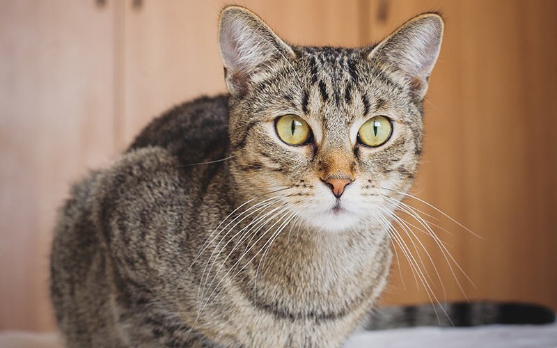

# Alexnet
## image classification 
To run the pretrained model:
```bash
$ python demo.py ./dog.jpg
```
### Results
<p align="center">
  
</p>

```bash
Labrador retriever: 53.45%
Saluki, gazelle hound: 18.93%
golden retriever: 15.33%
borzoi, Russian wolfhound: 2.79%
kuvasz: 1.94%
```
<p align="center">
  
</p>

```bash
tabby, tabby cat: 48.87%
Egyptian cat: 29.46%
tiger cat: 13.23%
tiger, Panthera tigris: 4.30%
lynx, catamount: 2.98%
```
